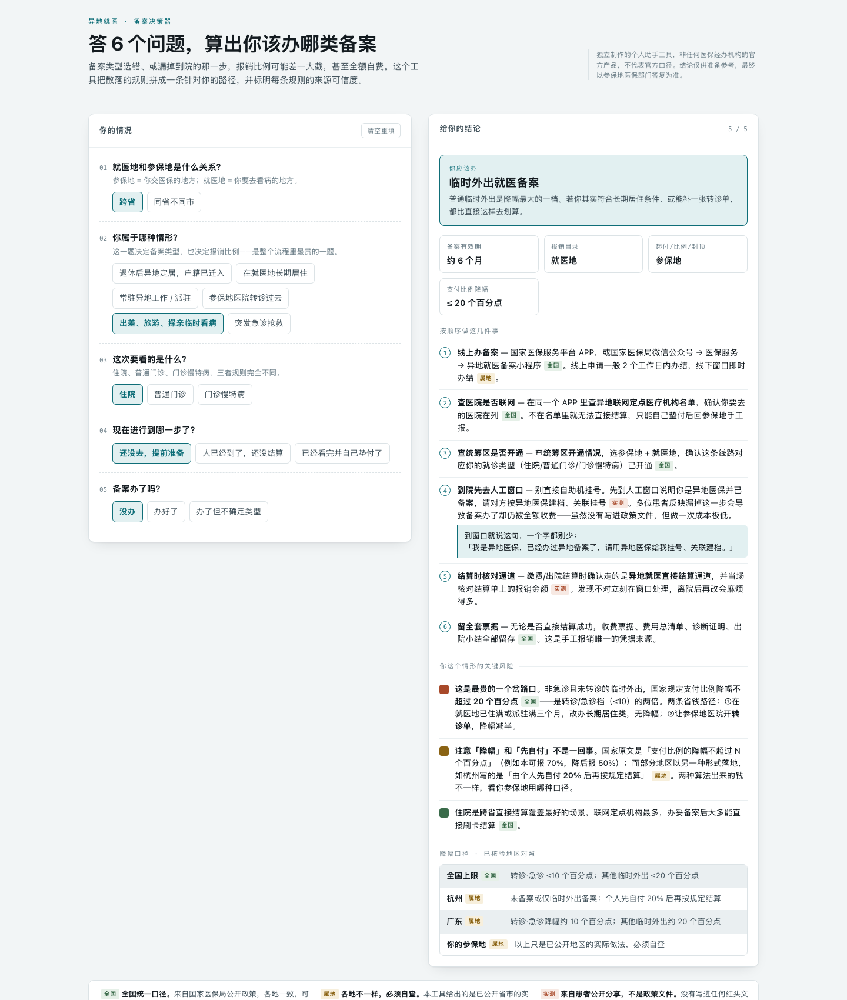

# 异地就医备案 · 决策器

**答 6 个问题，算出你该办哪类备案。** 单文件 HTML，无后端、无依赖、无埋点，双击就能用。

> **English** — A single-file decision tool for China's cross-province medical insurance filing (*yìdì jiùyī bèi'àn*). Six questions map a user's situation onto the correct filing category, then output the reimbursement consequences and an ordered action checklist. Every claim carries a **source-credibility tier** (national policy / provincial variance / patient-reported), because the cost of a confidently wrong number here is a user losing 20 percentage points of reimbursement. No backend, no tracking, one HTML file.



---

## 这个工具解决什么

跨省看病要办备案，几乎人人知道。但**备案是分档的**，而档位选错的代价是钱：

- 按国家规定，转诊 / 急诊抢救人员支付比例降幅 **≤10 个百分点**；非急诊又没转诊的其他临时外出人员降幅 **≤20 个百分点**〔医保发〔2022〕22 号〕。同一家医院、同一个病，两档之间差一倍。
- 长期居住人员则原则上**执行参保地本地标准**——办对这一档，基本没有降幅。

问题在于：规则散在国家文件、省市细则、和患者实际遭遇之间，没有一处把它们拼成"针对你这一种情况"的路径。这个工具就是那次拼装。

## 做法上值得说的一件事：三档来源标注

医保是那种**说错一个数字就会被评论区当场拆穿**的题材。所以工具里每一条结论都必须带出处等级，而不是笼统地说"根据规定"：

| 标签 | 含义 | 可信度边界 |
|---|---|---|
| **全国** | 来自国家医保局公开政策，各地一致 | 可直接引用 |
| **属地** | 各地执行口径不同，工具给的是**已公开省市的实际做法** | 必须自查参保地 |
| **实测** | 来自患者公开分享，**不是政策文件** | 提示存在，不作承诺 |

结论区还有一块"降幅口径 · 已核验地区对照"，把全国上限、杭州、广东三种写法并排放着——因为"降幅 20 个百分点"和杭州的"个人先自付 20% 后再按规定结算"**是两种算法、两个结果**，混在一起讲就是错的。

这套分档是整个工具真正的产品决策：**宁可把不确定明确标出来，也不给一个看起来干净、实际会害人的答案。**

## 结果

- 6 个输入 → 5 类备案结论，覆盖 7 个会导致钱数不同的分叉口
- 每条结论配一份**按顺序执行**的动作清单（含到院人工窗口该说的那一句原话）
- 明暗双主题、移动端自适应，9 张状态截图见 [`screenshots/`](screenshots/)

## 怎么跑

```bash
open index.html
```

没有构建步骤、没有 npm、没有网络请求。整个工具是一个 31KB 的 HTML 文件。

## 免责

独立制作的个人助手工具，非任何医保经办机构的官方产品，不代表官方口径。各地执行口径不同，结论仅供备案参考，**最终以参保地医保部门的答复为准**。

## License

MIT
